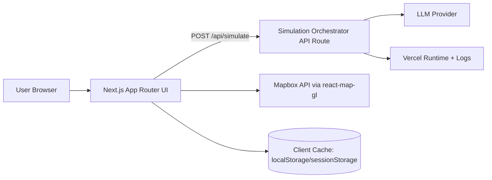
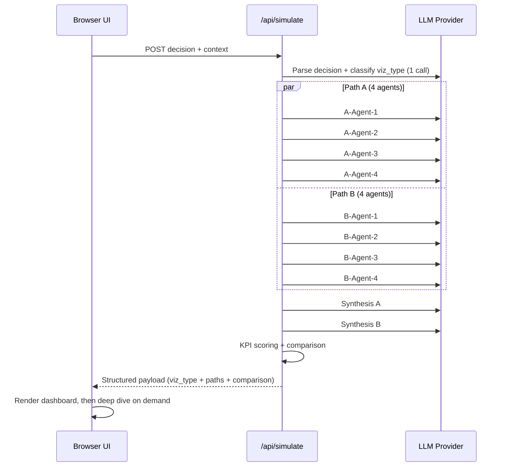

# FORESIGHT Technical Architecture

## 1) Architecture Scope and Goals

This architecture defines a hackathon-ready, desktop-first web application that fulfills the PRD and UX direction:

- **Primary stack:** Next.js 14 + TypeScript + Tailwind CSS + Framer Motion + react-map-gl
- **Primary contract:** `POST /api/simulate`
- **Core orchestration:** parse/classify -> **8 parallel agent calls** (4 agents x 2 paths) -> **2 synthesis calls**
- **Adaptive visualization:** `viz_type` routes to Map / Flow / Network with fallback support
- **Resilience:** cached full results + graceful fallback visual path
- **UX alignment:** Base Direction 6 (KPI-centric center) with Direction 1 structural balance, Direction 4 narrative continuity, and Direction 5 mode identity

## 2) System Context

## Actors

- **Primary user:** SMB operator running an either/or decision simulation.
- **Presenter/operator:** Runs rehearsed scenarios in demo mode.
- **Integrator/developer:** Uses the same backend contract for tests/replay.

## External Systems

- **LLM provider API:** powers classification, agent simulations, synthesis.
- **Map provider (Mapbox):** map rendering in Map mode.
- **Vercel platform:** web hosting, serverless runtime, environment secrets.

## Context Diagram (logical)



## 3) Component Architecture

## Frontend Layers

### App/Shell Layer

- `app/layout.tsx`, `app/page.tsx`
- Global dark-theme tokens and desktop-first layout framing
- Metadata and top-level providers

### State/Flow Layer

- Journey state machine: `input -> running -> dashboard -> deepDive`
- Run lifecycle: `idle -> submitting -> streaming/polling -> completed | fallback | error`
- Stable orientation anchors: path labels + mode badge + center intelligence column

### Feature Components

- **Input:** `DecisionForm`, `ContextFields`, `GlowButton`
- **Running:** `SimulationContainer`, `PanelHeader`, `ModeBadge`, `AgentHUD`, `VizRouter`
- **Results:** `KPICard`, `ScoreRing`, `WinnerBadge`
- **Detail:** `DeepDivePanel` with path tabs and attribution markers
- **Resilience:** `FallbackViz`, `RecoveryNotice`, replay indicators

### Visualization Layer

- `MapView` (react-map-gl + overlays)
- `FlowView` (resource pipeline animation)
- `NetworkView` (graph relationships)
- `FallbackViz` (mode-agnostic simplified comparative visualization)

## Backend Layers (single route, modular internals)

- **Route handler:** request validation, auth/rate checks, response contract
- **Orchestrator service:** run id creation, concurrency orchestration, final assembly
- **Prompt layer:** parse/classify, role prompts, synthesis prompts
- **Provider adapter:** model calls, retries, timeout handling, normalized errors
- **Scoring/comparison module:** KPI normalization and winner derivation
- **Telemetry module:** latency, error type, fallback reason, token/cost estimates

## 4) API Contracts

## Endpoint

- **Method:** `POST`
- **Path:** `/api/simulate`
- **Auth:** none for MVP (optional demo token header)
- **Content-Type:** `application/json`

## Request Contract

```json
{
  "decision": "Should I invest in Instagram ads or partner with Cafe Central?",
  "context": {
    "industry": "bakery",
    "monthlyRevenue": 3000,
    "location": "Malasana, Madrid",
    "customerBase": "200 regulars",
    "details": "Foot traffic heavy, limited marketing budget"
  },
  "options": {
    "stream": false,
    "useCachedOnFailure": true,
    "demoScenarioId": "map-bakery-v1"
  }
}
```

## Response Contract (canonical)

```json
{
  "runId": "run_01HXYZ...",
  "status": "completed",
  "viz_type": "map",
  "path_labels": {
    "A": "Invest in Instagram ads",
    "B": "Partner with Cafe Central"
  },
  "progress": {
    "agents_per_path": 4,
    "agent_states": {
      "A": ["complete", "complete", "complete", "complete"],
      "B": ["complete", "complete", "complete", "complete"]
    }
  },
  "paths": {
    "A": {
      "agents": [
        { "role": "customer", "insight": "...", "confidence": 0.72, "grounding": "mixed" },
        { "role": "competitor", "insight": "...", "confidence": 0.65, "grounding": "assumed" }
      ],
      "synthesis": {
        "summary": "...",
        "timeline": [
          { "month": 1, "narrative": "...", "drivers": ["customer", "cashflow"] }
        ]
      },
      "kpis": {
        "revenueImpact": 12,
        "risk": 58,
        "customerImpact": 71,
        "operatingCosts": 43,
        "competitiveExposure": 50,
        "opportunityCost": "Potentially miss local referral momentum",
        "overallScore": 67
      }
    },
    "B": {
      "agents": [],
      "synthesis": {},
      "kpis": {}
    }
  },
  "comparison": {
    "winnerByKpi": {
      "revenueImpact": "A",
      "risk": "B"
    },
    "overallWinner": "A"
  },
  "meta": {
    "latencyMs": 8120,
    "llmCalls": 11,
    "estimatedCostEur": 0.19,
    "fallbackUsed": false,
    "cachedReplay": false,
    "generatedAt": "2026-03-24T20:12:00Z"
  }
}
```

## Error Contract

```json
{
  "runId": "run_...",
  "status": "error",
  "error": {
    "code": "PROVIDER_TIMEOUT",
    "message": "Live simulation unavailable.",
    "recoverable": true
  },
  "recovery": {
    "canUseCache": true,
    "fallbackViz": true
  }
}
```

## 5) Orchestration and Data Flow

## Request Lifecycle



## Data Flow Rules

- Agent calls are **isolated** per PRD requirement (no cross-agent visibility).
- Synthesis reads only same-path agent outputs.
- UI derives all presentation from typed payload (no prompt text parsing in UI).
- `viz_type` is authoritative for `VizRouter`.
- Cache writes happen only after schema validation succeeds.

## 6) State Management Strategy

## Approach

- Use local React state + reducer in a top-level simulation store (no heavy global library required for MVP).
- Keep server state transitions explicit to prevent race conditions in animation-heavy screens.

## State Shape (conceptual)

- `uiStage`: `input | running | dashboard | deepDive`
- `runStatus`: `idle | submitting | inProgress | completed | fallback | error`
- `vizType`: `map | flow | network | fallback`
- `progress`: per-path per-agent states
- `result`: validated canonical response object
- `recovery`: `cacheAvailable`, `fallbackReason`, `isReplay`

## Transition Guarantees

- Always preserve path labels once run starts.
- Never show dashboard until both synthesis outputs are present or fallback path is selected.
- Deep Dive cannot open without a resolved result object.

## 7) Error Handling, Fallback, and Cache Strategy

## Failure Classes

- Provider timeout / transient API failure
- Partial agent completion
- Map/WebGL unavailable
- Contract validation failure

## Recovery Strategy

1. **Retry policy (server):** bounded retries with jitter for provider timeouts.
2. **Partial completion handling:** if path synthesis impossible, mark run recoverable and attempt cache.
3. **Cache replay (client):** load latest valid full payload (or golden scenario) and proceed with same UI choreography.
4. **Visualization fallback:** if mode renderer fails, force `FallbackViz` while keeping KPI and narrative outputs.
5. **Honest messaging:** optional replay badge and fallback notice without breaking confidence.

## Cache Policy

- Store **full validated response JSON** with:
  - schema version
  - created timestamp
  - source (`live` or `golden`)
- Evict with bounded count + TTL to satisfy PRD data minimization.

## 8) Performance and Cost Constraints

## Performance Targets (aligned to PRD/NFR)

- p75 perceived simulation flow: <= 12s
- p75 backend orchestration: ~5-8s target, <= 8s objective under nominal provider latency
- Dashboard settle after completion: <= 3s
- Main thread remains responsive during animation and map rendering

## Cost Guardrails

- Target per run: **~EUR0.10-0.30**
- Expected call budget: **~11 LLM calls/run**
- Enforce bounded prompt lengths and output token caps
- Log estimated cost per run for demo and budget awareness

## Performance Controls

- Parallelize 8 agent calls with concurrency cap controls
- Lazy-load heavy visualization modules by `viz_type`
- Keep response payload compact (summary + bounded timeline detail)
- Prefer memoized rendering for KPI and panel components

## 9) Security and Compliance Posture (MVP)

- Secrets only in server environment (`LLM_API_KEY`, `MAPBOX_TOKEN_SERVER` where applicable)
- HTTPS-only production on Vercel
- Input validation on `decision` and context fields (length/type constraints)
- Output schema validation before client caching/render
- No persistent user account storage required for MVP
- Basic abuse protection: route-level rate limits / burst protection
- Log redaction for sensitive free-text fields in observability data

## 10) Deployment Architecture (Vercel)

## Runtime Topology

- **Frontend + API route:** deployed together on Vercel (single Next.js project)
- **Branch strategy:** follow repo process (`main` integration, `live` production promotion)
- **Env separation:** preview vs production variables in Vercel project settings

## Required Environment Variables

- `LLM_API_KEY`
- `LLM_MODEL_PARSE_CLASSIFY`
- `LLM_MODEL_AGENT`
- `LLM_MODEL_SYNTHESIS`
- `MAPBOX_ACCESS_TOKEN` (public map token for client map rendering)
- `ENABLE_GOLDEN_REPLAY` (feature flag)
- `SIMULATION_TIMEOUT_MS`

## Build/Release Controls

- PR checks: typecheck + lint + build
- Smoke test: one canned scenario per viz mode
- Pre-demo checklist: cached replay path + fallback mode + projector contrast

## 11) Architectural Decisions and Boundaries

## Decisions

- **ADR-01:** Next.js 14 App Router as unified frontend+API platform on Vercel.
- **ADR-02:** Single orchestrator endpoint (`POST /api/simulate`) for MVP simplicity and contract stability.
- **ADR-03:** Parallel isolated agent execution with per-path synthesis.
- **ADR-04:** `viz_type` as backend-owned routing decision to keep UI deterministic.
- **ADR-05:** Fallback and cache are first-class success paths, not exceptional UX.

## Boundaries

- UI never calls LLM provider directly.
- Prompt logic stays server-side in dedicated modules.
- Visualization components consume typed data only.
- Cache handling remains client-local and bounded.

## 12) Implementation Roadmap (UX-aligned)

## Phase 1: Foundation and Contracts

- Scaffold typed domain models (`simulate.request`, `simulate.response`, errors).
- Implement `/api/simulate` with parse/classify + mock agent/synthesis adapters.
- Build desktop-first shell and state machine for 4 major screens.
- Deliver Base Direction 6 center-focused layout skeleton.

## Phase 2: Simulation Experience (Base 6 + Direction 1)

- Implement `SimulationContainer`, `PanelHeader`, `ModeBadge`, `AgentHUD`.
- Add side-panel symmetry and stable spacing rhythm from Direction 1.
- Wire progress states to deterministic HUD transitions.

## Phase 3: Adaptive Visualization (Direction 5 emphasis)

- Implement `VizRouter` + polished `MapView` and `FlowView`.
- Add `NetworkView` baseline and enforce `FallbackViz` parity.
- Strengthen mode identity via badge + accent semantics.

## Phase 4: Comparison + Narrative (Direction 4 continuity)

- Build KPI stack, score rings, winner cues (center-priority).
- Implement Deep Dive tabs with causal monthly narrative and attribution markers.
- Preserve continuity transitions from results to deep dive.

## Phase 5: Resilience, Validation, and Demo Hardening

- Add cache replay and explicit degraded-mode handling.
- Validate 3 canned scenarios (Map / Flow / Network forced outcomes).
- Instrument latency/cost/fallback telemetry and finalize deployment script.

## 13) Definition of Done for Hackathon Slice

- One live run completes full loop: Input -> Running -> Dashboard -> Deep Dive.
- `POST /api/simulate` returns valid typed payload with `viz_type`, path outputs, and comparisons.
- 8 parallel agents + 2 synthesis calls executed server-side with bounded latency.
- Two polished modes + robust fallback pass demo criteria.
- Cached replay successfully completes flow when provider/network fails.
- Vercel deployment is reproducible and branch promotion process is documented.

