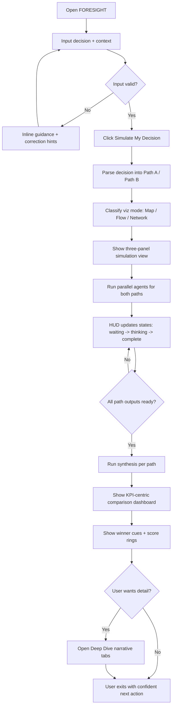
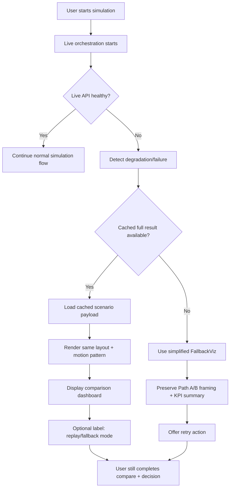
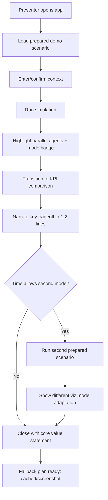

# UX Design Specification FORESIGHT

**Author:** Phillip
**Date:** March 24, 2026

---

<!-- UX design content will be appended sequentially through collaborative workflow steps -->

## Executive Summary

### Project Vision

FORESIGHT is a visual decision simulation product that helps small business owners reduce decision anxiety by previewing likely consequences before committing. Instead of giving prescriptive advice, it runs two parallel futures (Path A vs Path B) and presents an understandable comparison through adaptive visuals, agent-driven insights, and KPI-based outcomes. The core UX promise is speed-to-clarity: users should move from uncertainty to informed confidence in a single simulation run.

### Target Users

Primary users are small business owners/operators making frequent either/or decisions with incomplete information, limited advisory support, and little time. They need practical, immediate clarity rather than deep analytical tooling.

Secondary users include:
- Presenters/operators running high-stakes demos (e.g., hackathon judges), requiring resilient, predictable UX under network risk.
- Technical integrators consuming the same simulation contract (`POST /api/simulate`) for UI or test harness use.

User profile assumptions from docs:
- Tech comfort: low-to-medium (product must feel intuitive, not technical).
- Device context: desktop/laptop-first for full simulation experience and side-by-side visual comparison.
- Usage moments: operational decision points during business planning or rapid tradeoff evaluation.

### Key Design Challenges

1. Translating complex AI orchestration into immediate trust: Users must understand progress and outcomes without being exposed to model complexity or prompt mechanics.
2. Preserving clarity across adaptive visualization modes: The experience must remain coherent and comparable whether the classifier selects Map, Flow, or Network.
3. Balancing speed, confidence, and resilience: UX must feel fast (8-12s perceived run), communicate uncertainty honestly, and recover gracefully via fallback/cached paths when live execution fails.
4. Maintaining side-by-side comparability: Both paths need consistent visual hierarchy, labels, and KPI framing so users can decide quickly without cognitive overload.

### Design Opportunities

1. Turn uncertainty into a guided visual ritual: A strong Input -> Simulation -> Dashboard -> Deep Dive progression can create a repeatable decision confidence experience users return to.
2. Differentiate through adaptive metaphors: Automatically selecting the right visual language (Map/Flow/Network) can make FORESIGHT feel context-aware and uniquely actionable versus generic chat tools.
3. Build trust through transparent simulation framing: Clearly showing simulated consequences, not guaranteed outcomes, plus confidence/grounding cues can improve credibility and responsible usage.
4. Use resilience as a product strength: Well-designed fallback behavior (not just error handling) can make the product feel dependable in real-world conditions and live demos.

## Core User Experience

### Defining Experience

The core user action in FORESIGHT is running a single high-stakes either/or decision through a side-by-side simulation and reaching a confident next step. The product's value is delivered through one repeatable loop: enter decision context -> launch simulation -> watch parallel consequences -> compare outcomes -> optionally inspect deep narrative. If this loop is clear, fast, and trustworthy, the rest of the experience succeeds.

The most critical interaction to get right is the transition from uncertainty to comparison clarity in one run. Users should never wonder what is happening, what changed between paths, or what to do next.

### Platform Strategy

FORESIGHT is a web application optimized for desktop/laptop use in the MVP phase. Mobile is explicitly out of scope for MVP UX design. Interaction is primarily mouse/keyboard with keyboard-accessible primary controls where feasible.

Platform priorities:
- Preserve side-by-side readability for Path A vs Path B and center HUD/KPI stack.
- Maintain smooth visual performance through animation-heavy states.
- Support resilient behavior when live APIs fail (cached result and fallback visualization paths).
- Keep deployment and operational flow aligned with existing branch/deploy process (integration on `main`, production on `live`).

### Effortless Interactions

The following must feel effortless:
- Writing or pasting a decision and minimal context, then launching with one clear CTA.
- Understanding simulation progress at a glance (agent states + mode badge).
- Comparing both paths quickly without parsing long text blocks.
- Identifying which path wins on each KPI and why.
- Moving into and out of deep dive without losing orientation.

Automatic behaviors that reduce friction:
- Decision-type detection and visualization mode selection.
- Agent role adaptation based on mode.
- Structured KPI synthesis from agent outputs.
- Graceful fallback to cached/simplified visualization when needed.

### Critical Success Moments

1. Run initiation confidence: user clicks "Simulate My Decision" and immediately sees a credible, intentional simulation state.
2. Live comprehension moment: during simulation, the user can track what each side is doing without technical interpretation.
3. Comparison clarity moment: dashboard reveals clear, scannable differences and winner cues in seconds.
4. Trust moment: user understands outputs are simulated consequences with visible confidence/grounding context.
5. Resilience moment: if live execution degrades, the experience still completes with coherent results.

Failure in any of these moments risks breaking user trust and the product's core promise.

### Experience Principles

- Clarity over complexity: hide orchestration complexity; expose meaning.
- Comparison-first UX: every screen reinforces Path A vs Path B understanding.
- Progressive disclosure: quick decision signal first, deep narrative second.
- Adaptive but consistent: Map/Flow/Network vary the metaphor, not the cognitive model.
- Resilient by design: fallback behavior is part of the primary experience, not an edge case.
- Trust through transparency: communicate confidence and limitations without undermining usability.

## Desired Emotional Response

### Primary Emotional Goals

FORESIGHT should primarily make users feel calm, in control, and confident when facing uncertain business decisions. The product should transform decision anxiety into informed readiness by making consequences visible and comparable.

Primary emotional target:
- "I can see both futures clearly, and I can choose with confidence."

Secondary goals:
- Trust in the process (the system feels credible and transparent).
- Momentum (users feel they can act now, not overthink endlessly).
- Professional confidence (users feel prepared to explain their choice to partners, lenders, or team members).

### Emotional Journey Mapping

- Discovery / first impression: Users should feel intrigued but safe - "this looks sophisticated but understandable."
- Input stage: Users should feel guided and focused, not overwhelmed.
- Simulation stage (hero moment): Users should feel anticipation and growing trust as visible progress confirms the system is working.
- Results dashboard: Users should feel clarity and relief - tradeoffs become concrete and scannable.
- Deep dive: Users should feel validated and informed, with enough narrative depth to support real decisions.
- Error/fallback moments: Users should feel protected, not abandoned; continuity should preserve confidence even when live services fail.
- Return usage: Users should feel this is a reliable decision ritual they can reuse whenever stakes are high.

### Micro-Emotions

Most critical micro-emotions for FORESIGHT:
- Confidence over confusion: clear path labels, mode badge, and KPI hierarchy reduce ambiguity.
- Trust over skepticism: transparent simulated-consequence framing plus confidence/grounding cues.
- Constructive anticipation over anxiety: progress states and agent completion visuals during run.
- Accomplishment over frustration: users complete the full loop quickly and reach a usable recommendation context.
- Satisfaction over novelty-only delight: polish matters, but reliable clarity matters more than visual spectacle.

### Design Implications

Emotion-design connections:
- Calm control -> simple intake, one clear CTA, predictable state transitions, stable layout.
- Trust -> explicit simulation framing, visible confidence signals, no overclaiming certainty.
- Confidence to act -> side-by-side comparability, winner cues, KPI readability, concise summaries first.
- Resilience confidence -> seamless cached/fallback flows that preserve narrative and outcome coherence.
- Reduced anxiety -> limit cognitive load, avoid dense text walls in the primary decision moment.

Negative emotions to prevent:
- confusion from mode-switch inconsistency
- skepticism from black-box AI behavior
- frustration from stalled runs or dead-end errors
- overload from too many simultaneous visual priorities

### Emotional Design Principles

- Design for emotional de-risking, not excitement alone.
- Make progress visible at every stage to reduce uncertainty.
- Prioritize comparison clarity over feature density.
- Use motion to orient and reassure, never to distract.
- Treat fallback as a trust feature, not just technical recovery.
- Reinforce user agency: FORESIGHT informs the decision; the user owns the decision.

## UX Pattern Analysis & Inspiration

### Inspiring Products Analysis

**1) QuickBooks Online**
- Solves: Turning messy business finances into a clear daily snapshot.
- UX strengths: Immediate dashboard visibility, strong information hierarchy, clear status states (open/overdue/paid), and scenario-style planning views.
- Why it matters for FORESIGHT: It proves SMB users value fast, scannable what-changed and what-needs-action views over dense analytics.

**2) Square Dashboard**
- Solves: Rapid operational monitoring for business owners with limited time.
- UX strengths: Real-time summaries, trend comparisons, customizable dashboard focus, and straightforward reporting.
- Why it matters for FORESIGHT: Reinforces a decision-cockpit pattern where users can identify directional outcomes in seconds.

**3) Canva**
- Solves: Making complex creative output accessible to non-experts.
- UX strengths: Template-first workflow, low-friction editing, progressive complexity, and confidence-building defaults.
- Why it matters for FORESIGHT: Demonstrates how FORESIGHT should feel powerful without feeling technical, especially for low-to-medium tech comfort users.

### Transferable UX Patterns

**Navigation Patterns**
- Single primary flow with clear stages (Input -> Simulation -> Results -> Deep Dive), similar to guided progression in high-clarity tools.
- Status-rich dashboard surfaces that prioritize key indicators first and details second.

**Interaction Patterns**
- One dominant primary action at each stage (for example: Simulate, then Compare, then Dive Deeper).
- Progressive disclosure: concise summary first, expandable detail on demand.
- Visible system progress during waiting states to preserve trust (agent states, run progress).

**Visual Patterns**
- Card-based comparison blocks for KPI scanning and winner cues.
- Consistent visual grammar across modes (Map/Flow/Network), with adaptive metaphor but stable cognitive structure.
- Confidence cues plus explicit framing to support trust and avoid black-box perceptions.

### Anti-Patterns to Avoid

- Data-wall dashboards that overload users before they get directional clarity.
- Mode inconsistency where Map/Flow/Network feel like separate products.
- Hidden progress states during simulation (creates anxiety and skepticism).
- Over-animated interfaces that prioritize spectacle over comprehension.
- Ambiguous AI certainty language that implies prediction guarantees.

### Design Inspiration Strategy

**What to Adopt**
- QuickBooks/Square-style snapshot thinking: immediate top-level insight and clear what-this-means-now.
- Canva-style low-friction UX: simple first action, smart defaults, minimal jargon.

**What to Adapt**
- Dashboard density: keep FORESIGHT lighter than accounting tools, tuned for decision comparison rather than bookkeeping depth.
- Template-like guidance: adapt into decision-entry scaffolding and interpretation cues rather than design templates.

**What to Avoid**
- Generic analytics UI patterns that weaken FORESIGHT's simulation identity.
- Complex configuration requirements before first value.
- Any interaction that delays the core emotional win: "I can see both futures clearly."

## Design System Foundation

### 1.1 Design System Choice

Choice: Themeable system using Tailwind CSS + custom design tokens + focused custom components (no heavy component framework).

This is a balanced approach: fast delivery from a proven utility foundation, while preserving FORESIGHT's distinctive visual identity and motion-heavy simulation experience.

### Rationale for Selection

1. Speed under time constraint: Tailwind is already part of the documented stack and supports rapid implementation without introducing a new UI framework learning curve.
2. Brand and visual differentiation: FORESIGHT needs a strong simulation-cockpit identity; custom tokens/components allow this better than adopting a full, opinionated design system.
3. Technical fit for animation-first UX: Framer Motion + custom component structure is easier to control when not constrained by heavy prebuilt component abstractions.
4. Team practicality: Moderate complexity, low setup overhead, and straightforward collaboration for a 4-person team.
5. MVP scope alignment: Desktop-first, comparison-first, resilience-focused UX can be delivered quickly with a tokenized Tailwind approach.

### Implementation Approach

- Define global design tokens in `globals.css` / Tailwind theme extension:
  - color, typography, spacing, radius, shadow, motion timing, z-index layers.
- Build a small set of reusable primitives:
  - `GlowButton`, `ModeBadge`, `Card`, `PanelHeader`, `StatusPill`, `MetricValue`.
- Build domain components on top of primitives:
  - `AgentHUD`, `KPICard`, `ScoreRing`, `VizRouter`, per-mode visualization shells.
- Enforce consistent state patterns:
  - loading/running/completed/fallback/errored states share common visual language.
- Add accessibility defaults at primitive level:
  - focus-visible, semantic structure, contrast-safe token usage, reduced-motion hooks where feasible.

### Customization Strategy

Brand expression layer:
- Keep a dark command-center visual system as baseline.
- Use accent color by semantic role (agent slot colors, success/warning/risk states) and keep them consistent across modes.
- Use the provided AI concept image as a directional visual reference for split-screen comparison composition and KPI-center layout.

Component strategy:
- Reuse the same layout and interaction grammar for Map/Flow/Network; vary only the visualization metaphor.
- Keep KPI and comparison structures fixed to reduce cognitive load and improve trust.

Scalability strategy:
- Start with MVP token set and core primitives only.
- Add new tokens/components only when a repeated pattern appears at least twice.
- Document token usage and component intent inline to avoid drift during fast iteration.

## 2. Core User Experience

### 2.1 Defining Experience

The defining FORESIGHT experience is: "Run one business decision, watch two futures unfold side by side, and reach confident clarity in minutes."

If users describe FORESIGHT to others, the core interaction should be:
- "You type your decision once, and it shows both outcomes visually so you can compare instantly."

This interaction is the product's unique value moment because it combines:
- parallel simulation (Path A vs Path B),
- adaptive visualization (Map/Flow/Network),
- and immediate comparative judgment (KPI + winner cues),
in one continuous flow.

### 2.2 User Mental Model

Users arrive with a gut-check plus scattered-signals mental model:
- they currently decide via intuition, fragmented tools, and informal advice.
- they expect help that is fast and understandable, not technical or academic.
- they trust interfaces that show clear progress and concrete outcomes.

What they likely expect:
- one clear starting action
- visible system activity while waiting
- a quick so-what comparison at the end

Likely confusion points to design against:
- unclear difference between Path A and Path B
- uncertainty about what the system is doing during simulation
- doubt about whether outputs are facts, guesses, or advice

### 2.3 Success Criteria

The defining experience succeeds when:

1. Start clarity: User can launch simulation in one obvious step after entering minimal context.
2. Process trust: During simulation, user can see progress and understand that both paths are actively being evaluated.
3. Outcome clarity: Results make differences between paths obvious within seconds (no deep reading required).
4. Decision confidence: User feels "I can act on this" even if they still choose to review deep dive details.
5. Resilient continuity: If live API degrades, fallback still completes the comparison flow without breaking trust.

Operational indicators:
- first run reaches meaningful comparison quickly (target perceived 8-12s run phase)
- users can correctly explain why one path looks stronger
- users complete Input -> Simulation -> Dashboard without guidance

### 2.4 Novel UX Patterns

FORESIGHT uses a hybrid pattern strategy: familiar structures + novel composition.

Established patterns adopted:
- wizard-like staged progression
- dashboard cards and comparative metrics
- clear primary CTA and progressive disclosure

Novel combination:
- side-by-side, dual-future simulation as the primary interaction
- adaptive metaphor switching (Map/Flow/Network) under a consistent comparison frame
- agent-HUD-as-trust-layer (visible intelligence process without exposing prompt complexity)

This is not a fully unfamiliar interaction model; it is an innovative arrangement of familiar UX primitives, which minimizes training burden.

### 2.5 Experience Mechanics

1) Initiation:
- User enters either/or decision + lightweight context.
- One dominant CTA ("Simulate My Decision") starts the run.
- Path labels mirror user language to preserve ownership and comprehension.

2) Interaction:
- Interface transitions to three-panel simulation: Path A | center HUD | Path B.
- System selects visualization mode automatically from decision type.
- Both paths animate in parallel with synchronized structural layout.

3) Feedback:
- Agent HUD communicates progress state (waiting -> thinking -> complete).
- Mode badge and panel headers maintain orientation.
- Transitional motion confirms state changes without forcing extra user actions.

4) Completion:
- Dashboard reveals KPI comparison, winner cues, and per-path scoring.
- User can stop at fast comparison or continue into deep dive narrative.
- If degradation occurs, cached/fallback path preserves full decision ritual.

## Visual Design Foundation

### Color System

FORESIGHT uses a dark, command-center visual foundation optimized for focus, contrast, and side-by-side comparison clarity.

Core palette (from current project guidance):
- `--bg`: `#0F1923` (page background)
- `--surface`: `#1B2838` (cards/panels)
- `--border`: `#2A3A4A` (subtle separators)
- `--text`: `#F0F4F8` (primary text)
- `--text-dim`: `#8892A0` (secondary text)

Semantic accents:
- `--accent`: `#00D4AA` (primary action, positive outcomes, winner emphasis)
- `--blue`: `#2196F3` (agent slot 1 / info)
- `--red`: `#FF4757` (agent slot 2 / risk/negative)
- `--gold`: `#FFD700` (agent slot 4 / financial emphasis)
- `--warm`: `#FF6B35` (warning/intermediate risk)
- `--purple`: `#7B68EE` (network mode accent)

Visual direction rules:
- Keep center comparison stack readable first; visual effects are secondary.
- Preserve consistent semantic color mapping across Map/Flow/Network.
- Use the AI concept image as composition inspiration (left simulation, center KPI comparison, right simulation), not as literal style lock.

### Typography System

Typography should communicate confidence, technical credibility, and readability for decision-making.

Typefaces (from current spec direction):
- Headings: Space Grotesk (bold, modern, high signal)
- Body/UI labels: DM Sans (clean, readable at dashboard sizes)
- Data values/metrics: JetBrains Mono (numeric clarity for KPI and counters)

Hierarchy baseline:
- H1: 32-36px, bold
- H2: 24-28px, semibold/bold
- H3: 18-20px, semibold
- Body: 14-16px regular/medium
- Caption/meta: 12-13px medium
- KPI numeric emphasis: 20-28px mono, tabular feel

Readability principles:
- Prioritize scannability over decorative typography.
- Keep metric labels short and explicit.
- Use dim text only for secondary context, never for critical decision data.

### Spacing & Layout Foundation

Layout must optimize immediate A/B comparison while preserving orientation through animated state changes.

Base spacing system:
- 8px base unit (`4/8/16/24/32/40/48` usage scale).
- Dense-enough dashboard rhythm, with strategic whitespace around KPI groupings and panel transitions.

Grid/layout strategy (desktop-first MVP):
- Primary three-zone layout: `Path A | Center Intelligence | Path B`
- Center column acts as context anchor (HUD during run, KPI stack in results).
- Side panels keep mirrored structure to reduce cognitive switching cost.
- Consistent panel/header heights and alignment between states.

Component spacing principles:
- Tight internal spacing for metric cards; larger separation between card groups.
- Motion transitions should preserve spatial continuity (elements move predictably, not teleport).
- Deep Dive transition should retain side-strip context to avoid orientation loss.

### Accessibility Considerations

- Maintain WCAG AA contrast for all core text and KPI values on dark surfaces.
- Ensure primary actions and status states are not color-only (icons/labels + color).
- Keep keyboard-focus visibility strong on primary controls.
- Respect reduced-motion preferences where feasible without breaking comprehension.
- Preserve text alternatives for meaning-critical visuals in summary/deep-dive contexts.
- Validate projector/readability conditions for demo mode (large text and clear contrasts).

## Design Direction Decision

### Design Directions Explored

We explored six design directions in `_bmad-output/planning-artifacts/ux-design-directions.html`:

- Direction 1 - Balanced Command Center
- Direction 2 - Minimal Clarity
- Direction 3 - Data-Dense Analyst
- Direction 4 - Story-First Simulation
- Direction 5 - Mode-Forward Adaptive UI
- Direction 6 - KPI-Centric Comparison

Each direction varied layout emphasis, visual density, and interaction focus while staying within the approved visual foundation.

### Chosen Direction

Selected approach: **Base Direction 6 (KPI-Centric Comparison)** with targeted elements from **Directions 1, 4, and 5**.

Composition choice:
- Base 6 for center-dominant comparison speed and demo-safe clarity.
- Direction 1 elements for structural balance and predictable three-panel rhythm.
- Direction 4 elements for narrative continuity into deep dive.
- Direction 5 elements for stronger mode identity (Map/Flow/Network signaling).

### Design Rationale

- Supports FORESIGHT's primary success criterion: users can compare outcomes quickly and act with confidence.
- Keeps cognitive load low by anchoring decisions around a strong center KPI stack.
- Preserves the product's unique simulation identity through visible mode and story progression.
- Improves trust by keeping process context visible while prioritizing outcome clarity.
- Aligns with the desktop-first MVP and hackathon constraints (high readability, low implementation risk).

### Implementation Approach

- Use Direction 6 as the layout baseline in `SimulationContainer` and results state composition.
- Apply Direction 1 spacing/alignment discipline to keep side panels symmetrical and stable across transitions.
- Integrate Direction 4 narrative cues in the post-results flow and deep-dive entry affordance.
- Integrate Direction 5 mode emphasis via clearer mode badge treatment and mode-specific accent intensity.
- Validate the merged direction against: comparison speed, perceived trust, motion clarity, and fallback readability.

## User Journey Flows

### Journey 1 - Primary Decision Simulation (Happy Path)

Goal: user enters an either/or decision, runs simulation, and reaches clear comparative outcomes.

Design notes:
- Direction 6 baseline keeps KPI clarity central.
- Direction 1 balance ensures side context remains legible and not decorative-only.
- Direction 5 mode identity reinforces mental model during simulation.

### Journey 2 - Degraded Network / Fallback Recovery

Goal: preserve trust and complete the decision ritual even when live calls fail.

Design notes:
- Emotional target preserved: protected, not abandoned.
- Flow keeps the same structural rhythm to reduce confusion.
- Recovery states prioritize continuity over perfect realism.

### Journey 3 - Presenter Demo Flow (60-second Script)

Goal: operator demonstrates value quickly with predictable transitions and mode adaptivity.

Design notes:
- Optimized for confidence and consistency under live demo pressure.
- Prioritizes one complete loop before optional second scenario.
- Uses chosen direction emphasis: center clarity first, mode identity second.

### Journey Patterns

Common patterns to standardize across all journeys:
- Single dominant action per state (reduce hesitation).
- Persistent orientation anchors (path labels, mode badge, center status).
- Progressive disclosure (summary first, deep detail optional).
- Stable spatial model (same panel logic across run/results/fallback).
- Trust-preserving failure handling (no dead ends).

### Flow Optimization Principles

- Minimize steps to first comparative insight.
- Keep user cognition focused on tradeoffs, not tooling mechanics.
- Use motion to signal state change, not to decorate.
- Maintain path-label fidelity to user language throughout.
- Ensure every failure path still ends in a usable comparison outcome.

## Component Strategy

### Design System Components

Using the selected foundation (Tailwind + design tokens + custom components), we split components into:

Foundation components (token-driven, reusable):
- Button primitives (`GlowButton`, secondary/tertiary actions)
- Surface primitives (`Card`, `Panel`, `SectionHeader`)
- Feedback primitives (`StatusPill`, `ModeBadge`, `Toast/InlineAlert`)
- Data primitives (`MetricValue`, `ComparisonBar`, `LabelValue`)
- Navigation/layout primitives (`Tabs`, `PanelHeader`, `SplitLayout`)

What this gives us out of the box:
- consistent spacing, color, typography, focus treatment, and motion timing
- predictable states (default/hover/active/disabled/loading/error)
- faster implementation for non-unique UI

Gaps requiring custom components for FORESIGHT:
- Agent progress orchestration UI
- Dual-path simulation shells with adaptive mode behavior
- KPI-centric comparison stack + winner logic
- Deep-dive narrative with agent attribution
- Fallback visualization continuity components

### Custom Components

### AgentHUD

**Purpose:** Make AI orchestration visible and trustworthy without exposing model complexity.
**Usage:** Center panel during simulation phase.
**Anatomy:** Agent nodes, status ring, insight microcopy, completion state.
**States:** idle, thinking, partial-complete, complete, degraded/fallback.
**Variants:** compact (narrow center), standard (desktop default).
**Accessibility:** status changes announced via polite live region; icon + text status (not color-only).
**Content Guidelines:** insight snippets <= 2-5 words during live run.
**Interaction Behavior:** passive display; optional hover details in non-critical contexts.

### VizRouter + Mode Shells

**Purpose:** Route and render Map/Flow/Network/Fallback with stable structural grammar.
**Usage:** Left and right panels in simulation/results.
**Anatomy:** mode badge, visualization canvas, panel metadata footer.
**States:** loading, active, degraded, fallback.
**Variants:** MAP, FLOW, NETWORK, FALLBACK.
**Accessibility:** mode label always textual; meaningful alt/summary text for non-text visuals.
**Content Guidelines:** preserve identical panel header structure across modes.
**Interaction Behavior:** mode set automatically; no user mode switching in MVP.

### KPICard

**Purpose:** Present comparative outcomes quickly with clear winner cues.
**Usage:** Results center stack.
**Anatomy:** metric title, A/B values, comparison bars, winner badge, optional confidence hint.
**States:** skeleton, animating, settled, low-confidence indicator.
**Variants:** numeric, categorical, narrative (e.g., "What you'd miss").
**Accessibility:** values readable by screen readers; winner text explicit.
**Content Guidelines:** concise labels; avoid jargon and long descriptions.
**Interaction Behavior:** count-up and staggered reveal; no required user input.

### ScoreRing

**Purpose:** Summarize path-level attractiveness score at a glance.
**Usage:** Bottom of each path panel in results.
**Anatomy:** circular progress, numeric value, optional confidence micro-label.
**States:** hidden, animating, settled.
**Variants:** standard, compact.
**Accessibility:** score announced as text equivalent.
**Content Guidelines:** keep interpretation simple ("overall path score").
**Interaction Behavior:** synchronized entrance after KPI reveal.

### DeepDivePanel

**Purpose:** Provide explanatory narrative after quick comparison is complete.
**Usage:** optional expansion after dashboard review.
**Anatomy:** path tabs, narrative blocks, agent attribution dots, timeline structure.
**States:** collapsed, open-path-A, open-path-B, loading/replay.
**Variants:** default tabbed, compact strip context retained.
**Accessibility:** keyboard-tab navigation across paths and sections.
**Content Guidelines:** month-by-month structure, short paragraphs, clear causal language.
**Interaction Behavior:** transition preserves orientation from dashboard.

### FallbackViz

**Purpose:** Ensure comparison ritual still completes when preferred mode/data path fails.
**Usage:** degraded mode recovery path.
**Anatomy:** simplified visual motif, path framing, continuity cues.
**States:** active fallback, replay fallback, retry-available.
**Variants:** neutral fallback, mode-tinted fallback.
**Accessibility:** explicit fallback status message + next-step action.
**Content Guidelines:** honest but confidence-preserving copy.
**Interaction Behavior:** seamlessly swaps in without collapsing the overall flow.

### Component Implementation Strategy

- Build all custom components on shared tokens and primitives; no one-off styling in feature code.
- Standardize state contracts (`loading`, `running`, `complete`, `degraded`, `fallback`) across components.
- Keep visual grammar constant between Path A and Path B; only content differs.
- Co-locate component types/interfaces with reusable models to reduce drift.
- Add Storybook-like usage notes (or markdown specs) for each custom component state.
- Enforce accessibility checks at component level, not only screen level.

### Implementation Roadmap

Phase 1 - Core Journey Components (must-have for end-to-end flow):
- `DecisionForm`, `SimulationContainer`, `PanelHeader`, `VizRouter`, `AgentHUD`, `KPICard`, `ScoreRing`

Phase 2 - Trust and Resilience Components:
- `FallbackViz`, degraded-state messaging components, retry/continuity controls

Phase 3 - Narrative and Polish Components:
- `DeepDivePanel`, `PathTabs`, attribution markers, advanced transition polish

Phase 4 - Consistency and Scale Hardening:
- component docs/state matrix, visual regression checks, token audit for drift

## UX Consistency Patterns

### Button Hierarchy

Primary actions:
- Use for one dominant action per state (e.g., `Simulate My Decision`, `View Deep Dive`).
- Visual style: accent-filled, highest contrast, clear active/disabled/loading states.
- Placement: predictable position in each screen state (avoid moving primary CTA unexpectedly).

Secondary actions:
- Use for supportive but non-critical actions (e.g., `Back`, `Retry`, `Close`).
- Visual style: outlined or low-emphasis solid.
- Never compete visually with primary action.

Tertiary/text actions:
- Use for optional exploration (e.g., `Learn more`, `View assumptions`).
- Keep compact and non-distracting.

Behavior standards:
- Minimum touch/click target equivalent >= 40px height.
- Loading state replaces label with progress indicator and preserves width.
- Disabled state must explain why when relevant (tooltip/helper text).

### Feedback Patterns

Success:
- Brief confirmation + contextual meaning (e.g., "Simulation complete. Comparing outcomes now.").
- Avoid celebratory tone that implies guaranteed correctness.

Info:
- Neutral guidance during progress ("Running agent analysis...").
- Show where user is in flow and what happens next.

Warning:
- Use for degraded but recoverable states (e.g., fallback/replay mode).
- Include clear action path (`Retry`, `Continue with fallback`).

Error:
- Plain-language message, likely cause, and recovery action.
- Keep user in flow whenever possible (no dead-end modal walls).

Status language rule:
- Frame outputs as simulated consequences, not deterministic predictions.

### Form Patterns

Input structure:
- One large decision input + minimal context fields.
- Progressive disclosure for optional context to reduce initial friction.

Validation:
- Inline, immediate, and specific (what to fix + how).
- Do not block typing flow with intrusive modal errors.

Field behavior:
- Preserve user phrasing for Path A/Path B labels downstream.
- Provide examples/placeholders that reflect real SMB decisions.

Submission:
- Single clear primary CTA.
- On submit: transition quickly to visible progress state (<300ms perceived response).

### Navigation Patterns

Global structure:
- State-based journey: Input -> Simulation -> Dashboard -> Deep Dive.
- Keep orientation anchors persistent: path labels, mode badge, center status context.

In-state navigation:
- Deep Dive uses explicit tabs for Path A / Path B.
- Preserve side-strip context when center panel expands.

Back/exit behavior:
- Exiting detail should return users to prior comparison context, not restart journey.
- Support quick restart/new simulation without losing learned pattern familiarity.

### Additional Patterns

Loading states:
- Skeletons for KPI cards and panel content.
- AgentHUD progress states (waiting -> thinking -> complete) as primary trust signal.

Empty states:
- Explain what is missing and provide one immediate next action.
- Keep copy practical and non-technical.

Fallback/degraded states:
- Maintain same layout grammar as normal flow.
- Explicit but calm messaging ("Live run unavailable - showing saved comparison").

Modal/overlay usage:
- Prefer inline panels over blocking modals in core flow.
- Use modals only for critical confirmation or disruptive context changes.

Motion consistency:
- Motion communicates state transitions and continuity, not decoration.
- Respect reduced-motion preferences while preserving comprehension.

Desktop-first rule (MVP):
- Primary patterns optimized for desktop/laptop.
- Mobile can reuse semantic hierarchy later, but is out of MVP scope.

## Responsive Design & Accessibility

### Responsive Strategy

FORESIGHT is explicitly desktop-first for MVP, with responsive behavior focused on preserving core comparison clarity on laptop/desktop while maintaining graceful adaptation on smaller screens.

Desktop (primary target):
- Preserve full three-zone composition: `Path A | Center Intelligence | Path B`.
- Use expanded center KPI/HUD column for fast decision scanning.
- Keep side panels mirrored for low cognitive switching.

Tablet (secondary support):
- Maintain three-zone intent, but reduce visual density.
- Compress non-critical metadata and simplify secondary controls.
- Prioritize touch-friendly spacing and clear tab/segmented controls in deep-dive contexts.

Mobile (out of MVP scope):
- No full optimization commitment in MVP.
- If accessed, provide functional fallback layout emphasizing essential flow (input and summary) over full visual parity.
- Explicitly avoid promising full simulation fidelity on small screens during MVP.

### Breakpoint Strategy

Use a pragmatic breakpoint model aligned with current stack conventions:

- **sm**: `>=640px` (small screens baseline)
- **md**: `>=768px` (tablet entry)
- **lg**: `>=1024px` (desktop baseline, primary UX target)
- **xl**: `>=1280px` (enhanced desktop spacing/density)
- **2xl**: `>=1536px` (wide-screen refinement)

Implementation intent:
- Desktop-first visual logic at `lg+`.
- Controlled degradation below `lg` that preserves task completion and orientation anchors.
- Avoid one-off breakpoints unless a specific journey fails at standard thresholds.

### Accessibility Strategy

Target **WCAG 2.1 AA** for MVP.

Core accessibility commitments:
- Contrast-compliant text and KPI values on dark surfaces.
- Keyboard-operable primary journey (input -> simulate -> results -> deep dive).
- Visible focus states for all interactive elements.
- Non-color-only status communication (labels/icons + color).
- Reduced-motion support for non-essential animation.
- Semantic structure and ARIA support for dynamic status components (especially AgentHUD and fallback states).

Product-specific accessibility emphasis:
- Ensure comparison outcomes are understandable without relying on complex visuals alone.
- Provide text-equivalent summaries for key visual states and final outcomes.

### Testing Strategy

Responsive testing:
- Verify key states at representative widths: 640, 768, 1024, 1280, 1536.
- Test full journey on common desktop browsers (Chrome, Edge, Firefox, Safari).
- Validate projection/readability behavior for demo scenario.

Accessibility testing:
- Automated checks (axe/Lighthouse) on core pages and states.
- Keyboard-only traversal for all primary tasks.
- Screen reader spot checks on critical flows and dynamic status updates.
- Contrast audits across normal, warning, error, and fallback states.
- Reduced-motion verification for major transition sequences.

Scenario testing priorities:
1. Happy-path simulation completion
2. Degraded/fallback completion
3. Deep-dive navigation and return
4. Demo-flow readability under constrained conditions

### Implementation Guidelines

Responsive implementation:
- Use token-based spacing/typography scales with responsive variants.
- Keep structural anchors persistent across breakpoints (path labels, center context).
- Prefer progressive reduction of density over structural rewrites.
- Avoid fixed heights that break dynamic KPI/narrative content.

Accessibility implementation:
- Semantic HTML landmarks and heading hierarchy per state.
- ARIA live regions for simulation progress and completion events.
- Explicit labels for controls and tabs; logical tab order.
- Minimum target sizes and clear interaction affordances.
- Error and fallback copy that is actionable, concise, and non-alarming.

Definition of done (responsive + a11y):
- Core desktop journey passes visual and interaction checks.
- No critical AA contrast violations in primary flows.
- Keyboard path complete for core loop.
- Fallback flow remains understandable and operable.
